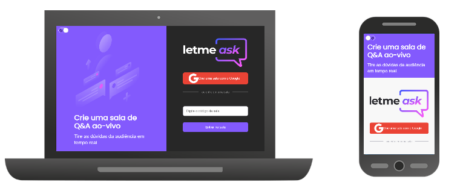
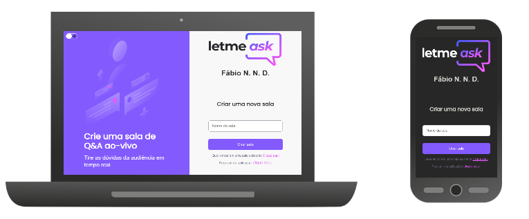
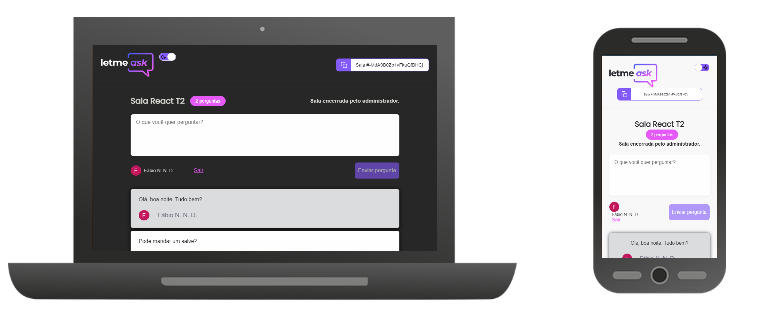
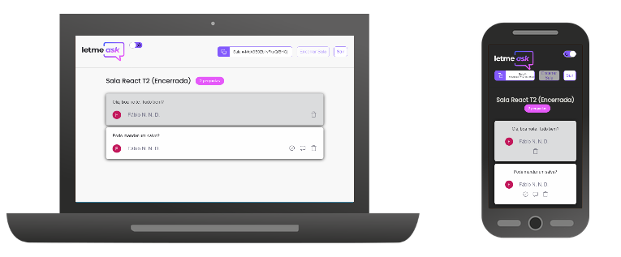

# Letme ask

<div align="center">
  
</div>

Plataforma para profissionais que criam conteúdo ao vivo possam gerenciar perguntas feitas por seus espectadores. Este projeto foi desenvolvido durante a NLW Together realizada pela Rocketseat.  

Para acessar a versão online do projeto, acesse (https://nlw-together-let-me-ask.web.app).  

## Público Alvo

- Profissionais que criam conteúdo por meio de transmissões ao vivo através da Internet em plataformas como Youtube ou Twich por exemplo;  
- Espectadores de criadores de conteúdo online.  

## Tecnologias

- ReactJs;  
- Typescript;  
- Google Firebase:  
    - Autenticação;  
    - Realtime Database;  
    - Hosting.
- Sass.

## Funcionalidades

### Criador(a) de conteúdo

- Criação de salas;  
- Destacar perguntas;    
- Marcar pergunta como respondida;   
- Deletar perguntas;  
- Copiar a identificação da sala para compartilhar.  

### Espectador(a)

- Realizar perguntas;  
- Marcar com "gostei" perguntas (semelhante ao "curtir" do Facebook ou Youtube);   
- Copiar a identificação da sala para compartilhar.  

### Observação.

Para criação de salas, envio de perguntas e marcação de perguntas, é necessário que o internauta esteja logado em sua conta de usuário do Google.  

## Aperfeiçoamentos

Para complementar os recursos desenvolvidos durante o evento, as seguintes funcionalidades foram acrescentadas:

- Aperfeiçoamento da checagens de autorização;  
- Fazer logout da conta Google;  
- Tema escuro;  
- Responsividade;  
- Página de erro: "Página não localizada".

## Layout da aplicação

O layout da aplicação foi desenvolvido pela design Rebecca Gonzalez(@rebeccagonzalez) e pode ser acessado pelo endereço a seguir:
https://www.figma.com/file/u0BQK8rCf2KgzcukdRRCWh/Letmeask?node-id=0%3A1

### Telas

#### Home

<div align="center">
  
</div>

#### Nova Sala

<div align="center">
  
</div>

#### Sala (Visão do espectador)

<div align="center">
  
</div>

#### Sala (Visão do administrador)

<div align="center">
  
</div>

### Observação

Para salvar o layout da aplicação em sua conta no Figma, acesse
https://www.figma.com/file/u0BQK8rCf2KgzcukdRRCWh/Letmeask/duplicate

## Requerimentos para execução em ambiente de desenvolvimento

1) Servidor ou computador com Node 14 ou superior.

2) Arquivo 'env.local' na pasta raiz do projeto com as variáveis de ambiente dos serviços de autenticação e realtime database do firebase.

Exemplo:

```bash
REACT_APP_APIKEY = "sua_apikey"
REACT_APP_AUTHDOMAIN = "AAA.TTT"
REACT_APP_DATABASEUR L= "AAA.BBB"
REACT_APP_PROJECTID = "AAA"
REACT_APP_STORAGEBUCKET = "AAA"
REACT_APP_MESSAGINGSENDERID = "000"
REACT_APP_APPID = "00"
```

### Para execução em ambiente de desenvolvimento local

A) Faça o download deste repositório para máquina local

Exemplo:

```bash
$ git clone https://github.com/fbnnd1/nlw-together-letmeask.git && cd nlw-together-letmeask
```

B) Instale todas as dependências do projeto

Exemplo:

```bash
$ npm install
```

C) No prompt de comando ou shell, execute o comando:

```bash
$ npm start
```

## Agradecimentos

Segue o agradecimento a toda a comunidade de devs que participou do evento e membros da Rocketseat, em especial ao professor Diego Fernandes.

## Links externos

- Rocketseat (https://rocketseat.com.br)  
- Canal da Twitch do professor Diego (https://www.twitch.tv/dieegosf)  
- Portfólio da designer Rebecca Gonzalez (https://dribbble.com/rebeccagonzalez)
